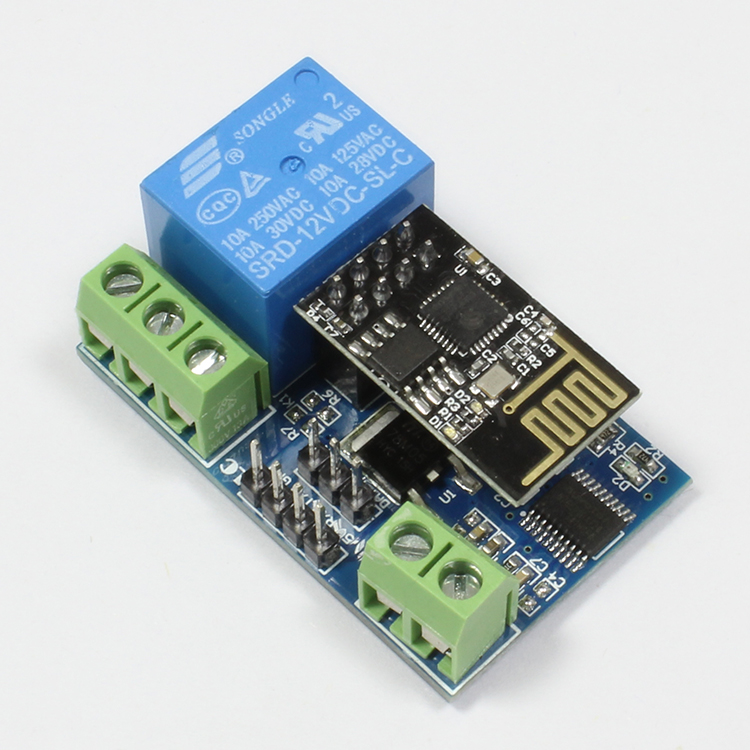
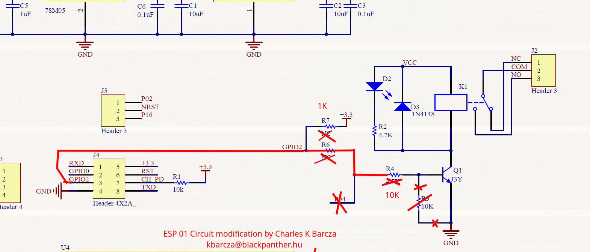
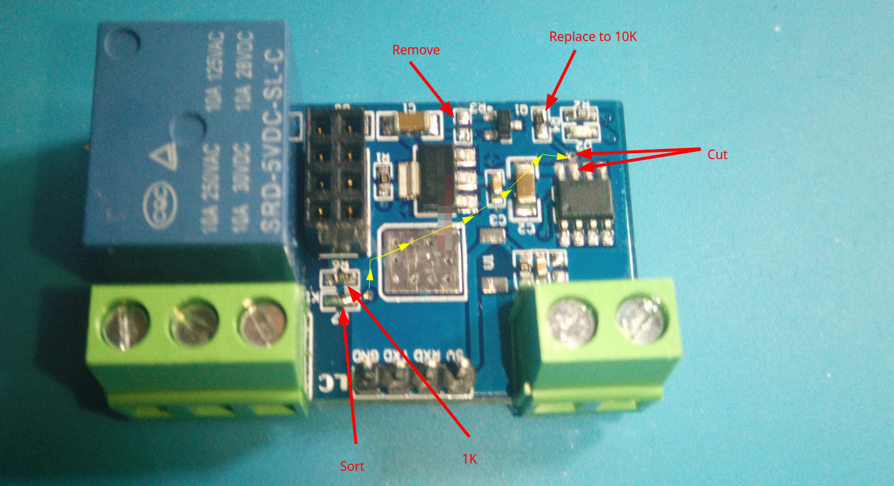
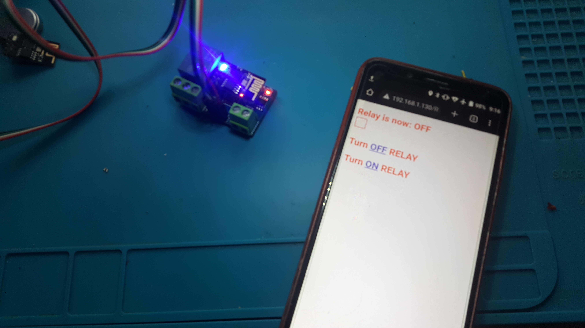
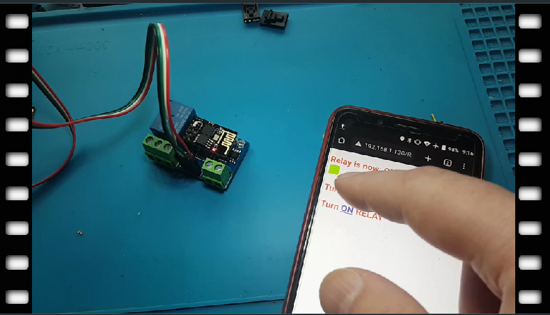

# ESP8266 ESP01 Relay module fix

**Original  info**

5V or 12V WiFi relay module carried a ESP8266 WiFi module and microcontroller.
It will send the serial port instructions to the cell phone APP and Implementation within the local area network (LAN) for wireless control relay.

**Vendor materials**

Product site: [http://www.chinalctech.com/cpzx/1/332.html](http://www.chinalctech.com/cpzx/1/332.html) 
More tools and docs under [vendor materials](vendor_materials) directory

  

# The issues

Realay **cannot switch** but the code running fine in esp8266 wifi module and GPIO send high signal

## Tha fix

**Test code**

[Arduino ino](test_code/esp01_relay_test.ino)  and [header with wifi login infor](test_code/relayExample_my_ssid_password.h)  all file available in ['test_code' ](test_code)  folder

* **The modified schematic** 

* **Modified circuit**

# At work

* **Relay test video**

*Modifcation by Charles K Barcza - <kbarcza@blackpantehr.hu>*
